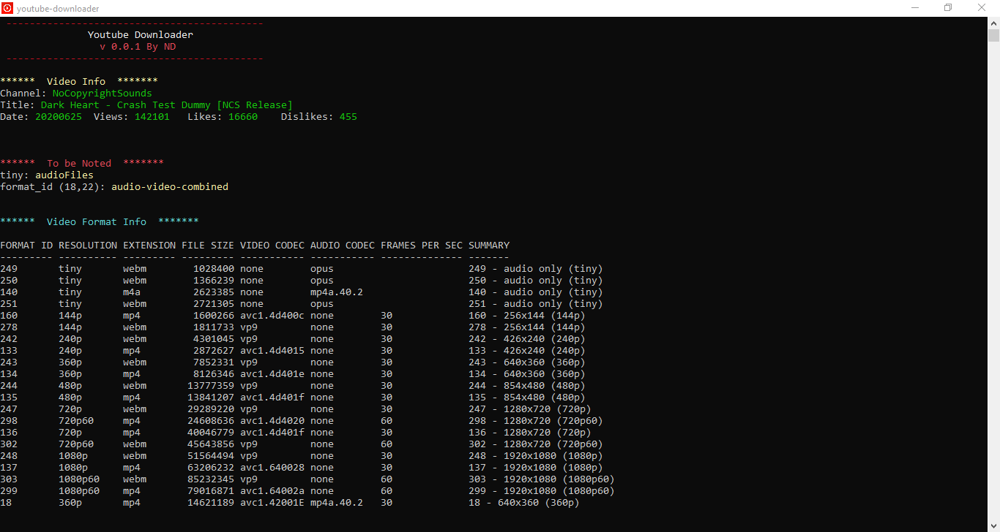

# Youtube Downloader CLI

Command Line Application Build on power-shell scripts to generate both audio and video download links to YouTube video across all available resolutions. Also supports direct download of videos in the specified audio and video format

>Version: 0.0.4

## Screen Shot




## External Dependencies
This project has two external dependencies

1. youtude-dl
2. ffmpeg

## User Setup Instructions
```
* Download the asset folder (zip/rar)
* For those who have ffmpeg installed and added to class path download the min version - otherwise download the full version
* Extract the content and run the 'init_shortcut.exe' file
* This will generate the shortcut 'youtube-downloader.lnk' file
* Copy paste this file in any convinient location to access the program


-> Downloaded video and links can be found in the video folder of the current user
-> Adding vlc to path : https://www.vlchelp.com/add-vlc-command-prompt-windows/


```


## Dependencies are already added in the bin folder of the zipped asset (full version)
* [youtube-dl](https://github.com/ytdl-org/youtube-dl/releases/download/2020.06.16.1/youtube-dl.exe)  
* [ffmpeg](https://ffmpeg.zeranoe.com/builds/win64/static/ffmpeg-4.2.3-win64-static.zip)

## Folder Structure for project setup
```
    Youtube Downloader
        |bin  
            downloader.ps1  
            ffmpeg.exe  
            ffplay.exe  
            ffprobe.exe  
            youtube-dl.exe  
        |res  
        shortcut.lnk
```

